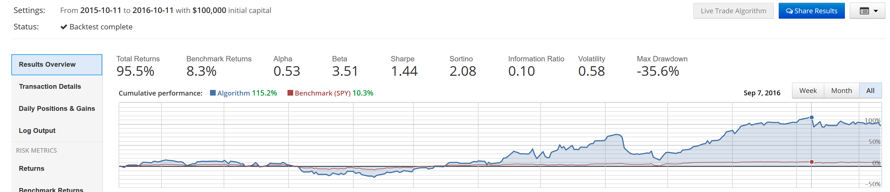

# Quantopian-Algos
My Quantopian Algorithms for Stock Trading on the Live Market

## VIX Algorithm which trades $UVXY

Below are results from an algo which shorts and covers UVXY to make profits based on data from VIX and SPY. UVXY prices fluctuate based on SPY. Its prices are the derivative of VIX prices. 
VIX does the opposite of what SPY does. If SPY rises, VIX drops. If SPY drops, VIX rises. This means under any disasters or political complications, VIX tends to rise. 
But on a day-to-day basis, VIX declines. This means UVXY declines, and shorting UVXY is ideal. 

## Trend Follow Algo

Attempting to use Linear Regression to follow trends for stock prices. Buying/Selling based on trend. 

## Better version of Valuation Algorithm: 

.PNG)

## Valuation Algorithm results: 

.PNG)

